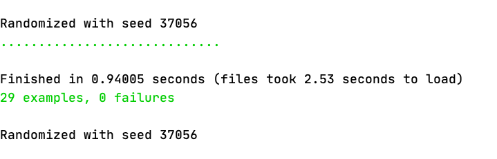
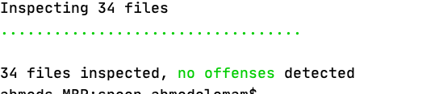
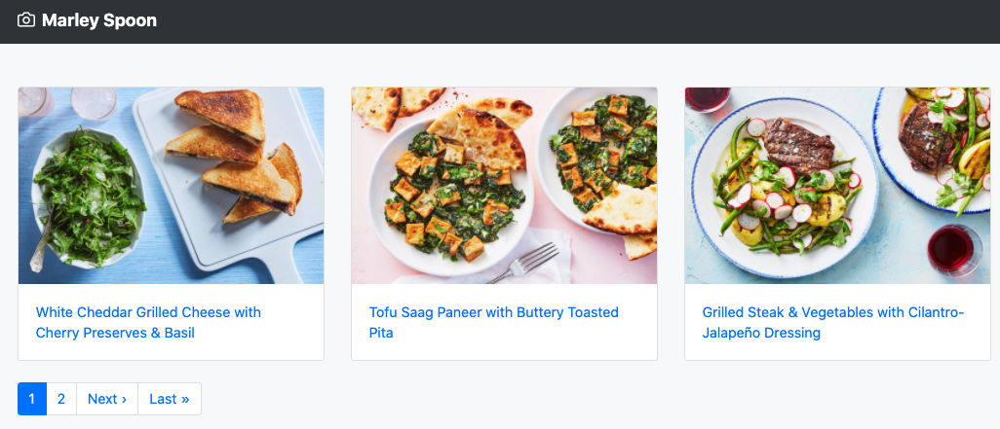
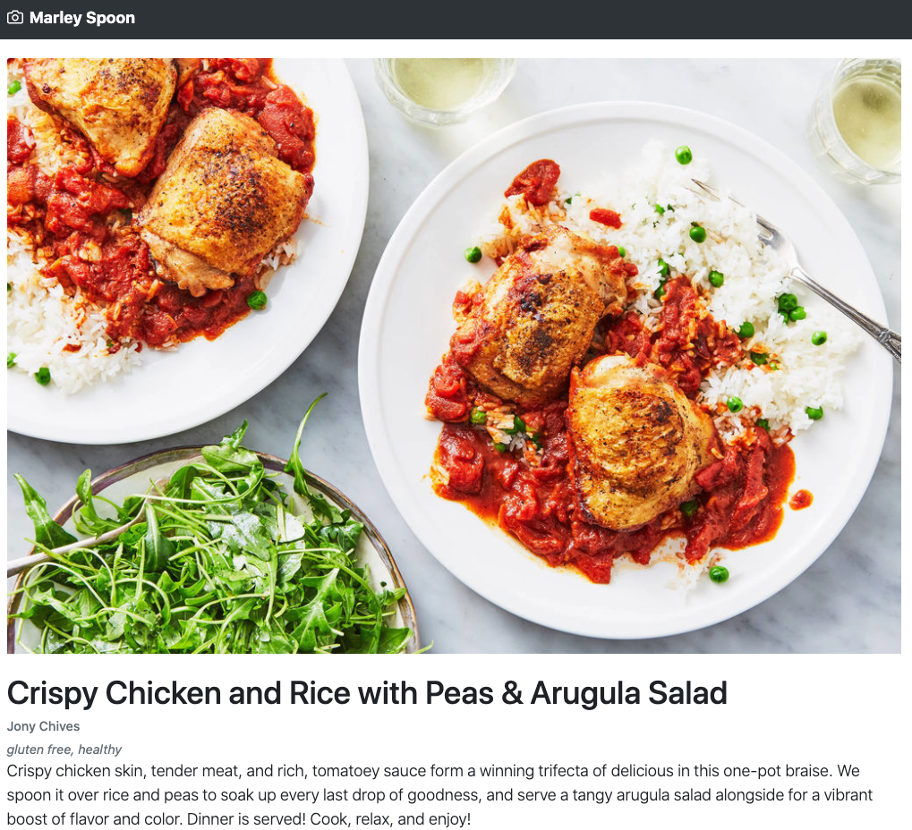

# Marley Spoon

Since the task goal is to set app to be production ready, I found that serving our App from Contentful Apis direct is not the best solution because it will be single point of failure for our app if contentful goes down or have any issue our app will down. 

So, I decided to import the data from Contentful in Background scheduled job to our database and keep our app working normally through our DB.

I created importer service to do this task and It will be scheduled using [whenever](https://github.com/javan/whenever) gem.

About the imported service I used [contentful](https://github.com/contentful/contentful.rb) gem.

For Performance handling:

* I added DB indices that would be needed to avoid full table scan when the table will be bigger.
* I added pagination.


Extra Enhancements:

* Enhance Importer service to get the updates only updated/deleted to make the sync faster using [contentful synchronization](https://www.contentful.com/developers/docs/references/content-delivery-api/#/reference/synchronization)
* We can also keep copy of images or assets on aws or private cdn.
* Add some caching using memcached to be able to handle as much requests as possible.

Ruby version:

* ruby-2.6.6

## Configuration

```bash
git clone
bundle install
```
* [Installing Node.js and Yarn](https://guides.rubyonrails.org/getting_started.html#installing-node-js-and-yarn)

* Create and Seed Database

```bash
bundle exec rake db:reset
```
You will need to rename .env.sample to be .env and edit it. 
```.env
CONTENTFUL_ACCESS_TOKEN=xxxxx
CONTENTFUL_SPACE_ID=xxxx
```
* Run Server

```bash
bundle exec rails s
```
* Run tests

```bash
bundle exec rspec
```


* Run rubocop

```bash
bundle exec rubocop
```



## Viewing Data
By visiting http://localhost:3000/recipes you should able to see view like this


I made the pagination with 2 recipes per page since we have 4 recipes only for demo.

after click on show you should see page like this




